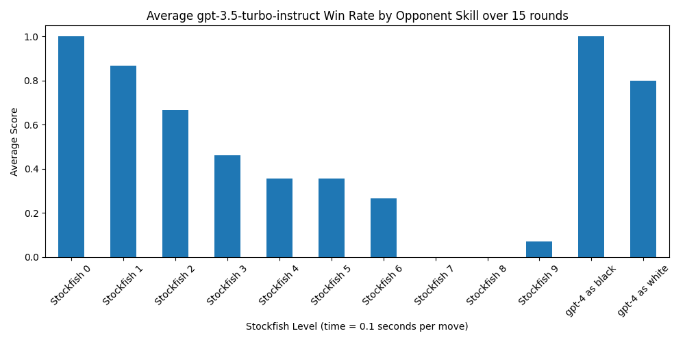

**Overview**

There has recently been some buzz about the ability of GPT-3.5-turbo-instruct's chess playing ability. I wanted to take a more rigourous look and created this repo. With it, you can play two models against each other, whether that's LLM vs Stockfish, LLM vs LLM, or Stockfish vs Stockfish. The primary goal is to test and record the performance of these players against one another in various configurations. Illegal moves, resignations, and game states are all tracked and recorded for later analysis. Per move, a model gets 5 illegal moves before forced resignation of the round.

**Results**

GPT-3.5-turbo instruct does well in 150 games against various Stockfish levels and 30 games against GPT-4. Most of gpt-4's losses were due to illegal moves, so it may be possible to come up with a prompt to have gpt-4 correct illegal moves and improve its score.



gpt-3.5-turbo-instruct's illegal move rate is under 0.1% over 8205 moves (possibly 0%, I had insufficient recording and state validation going on during my run... TODO), and the longest game had 147 moves.

`analysis.ipynb` results:
```
total moves: 8205, total illegal moves: 5 or less
Ratio of Player One's Illegal Moves to Total Moves: 0.0006 or less
Minimum Moves: 15
Maximum Moves: 147
Median Moves: 45.0
Standard Deviation of Moves: 21.90
```

All results were gathered on Stockfish 16 with 0.1 seconds per move on a 2023 M1 Mac. I ran a Stockfish benchmark using `% stockfish bench 1024 16 26 default depth nnue 1>/dev/null 2>stockfish_M1Mac.bench` and stored the output in `logs/stockfish_M1Mac.bench`.

**Setup**

- Install the necessary libraries in `requirements.txt` using pip.
- Copy paste your OpenAI API key in `gpt_inputs/api_key.txt`.
- If you plan on using StockfishPlayer, ensure Stockfish is installed on your system and accessible from your system path. On Mac, this is done with `brew install stockfish`. On Linux, you can use `apt install stockfish`.

**Game Recording**

- record_results(): This function logs the game's outcome, various statistics, and game states into a CSV file.
- Additionally, the entire game state is written to a game.txt file, although it gets overwritten every round.
- There is always a transcript of the most recent GPT API call and response in `gpt_outputs/transcript.txt`.

**How to Use**

- Set the desired players by instantiating them at the bottom of `main.py`.
- As an example, to pit `gpt-3.5-turbo-instruct` against Stockfish level 5 in a match of 15 rounds, do the following before running the program:

```
num_games = 15
player_one = GPTPlayer(model="gpt-3.5-turbo-instruct")
player_two = StockfishPlayer(skill_level=5, play_time=0.1)
play_game(player_one, player_two, num_games)
```

- For analysis and graphing purposes, you can check out the contents of `analysis.ipynb`.

**Other Capabilities**

There is the ability to run other models using OpenRouter or Hugging Face. However, I've found that other models, like Llama2-70b chat won't provide formatted moves, and Llama2-70b base will hallucinate illegal moves. In addition, it seems like gpt-4 consistently loses to gpt-3.5-turbo-instruct, usually due to forced resignation after 5 illegal moves.

In the local_llama branch, there is some working but poorly documented code to evaluate local Llama and NanoGPT models as well.

**Stockfish to ELO**

It's difficult to find Stockfish level to ELO ratings online. And of course, there are additional variables such as the time per move and the hardware it's ran on. I did find some estimates such as [this one](https://groups.google.com/g/picochess/c/AixKpYnCrRo):

sf20 : 3100.0
sf18 : 2757.1
sf15 : 2651.5
sf12 : 2470.1
sf9 : 2270.1
sf6 : 2012.8
sf3 : 1596.7
sf0 : 1242.4

But they should be taken with a grain of salt.